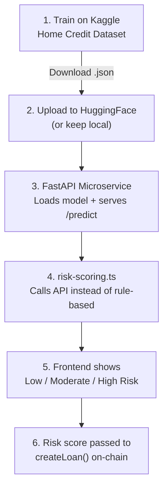

# AI-Based Risk Assessment — Implementation Plan

## Overview

Train an XGBoost classifier on the **Home Credit Default Risk** dataset on **Kaggle**, export the model, host it as a **Python FastAPI microservice**, and call it from the frontend's `risk-scoring.ts`.

```
Kaggle Notebook (Train) → Model File (.json) → HuggingFace or Local
    → FastAPI Microservice (Python) → risk-scoring.ts calls API → Frontend displays result
```

---

## 1. Dataset: Home Credit Default Risk

**Source:** [kaggle.com/competitions/home-credit-default-risk/data](https://www.kaggle.com/competitions/home-credit-default-risk/data)

### Key Files to Use

| File | Rows | What It Contains |
|------|------|-----------------|
| `application_train.csv` | 307K | Main training data — loan applications with TARGET (0=repaid, 1=defaulted) |
| `application_test.csv` | 48K | Test data (no labels, for Kaggle submission) |
| `bureau.csv` | 1.7M | Previous credits from other institutions |
| `previous_application.csv` | 1.6M | Previous loan applications at Home Credit |
| `installments_payments.csv` | 13.6M | Payment history on previous loans |

### Label Mapping (3 Classes from Binary TARGET)

The dataset has binary labels (0/1). We create 3 risk tiers using a **predicted probability threshold**:

```
Model predicts P(default) for each applicant:
  P(default) < 0.15  →  Low Risk
  0.15 ≤ P < 0.40    →  Moderate Risk  
  P(default) ≥ 0.40  →  High Risk
```

> [!TIP]
> Train a binary classifier first (default vs no-default), then use the probability output to create the 3 risk tiers. This is more effective than forcing 3-class classification on a binary dataset.

---

## 2. Kaggle Notebook — Step-by-Step

### Step 1: Create Notebook

1. Go to [kaggle.com/competitions/home-credit-default-risk](https://www.kaggle.com/competitions/home-credit-default-risk)
2. Click **"Code"** → **"New Notebook"**
3. Enable **GPU** (Settings → Accelerator → GPU T4 x2)
4. The dataset is auto-attached

### Step 2: Feature Engineering

```python
import pandas as pd
import numpy as np

# Load main table
app_train = pd.read_csv('/kaggle/input/home-credit-default-risk/application_train.csv')

# Load supplementary tables
bureau = pd.read_csv('/kaggle/input/home-credit-default-risk/bureau.csv')
prev_app = pd.read_csv('/kaggle/input/home-credit-default-risk/previous_application.csv')
installments = pd.read_csv('/kaggle/input/home-credit-default-risk/installments_payments.csv')

# ── Aggregate bureau data (previous credits from other institutions) ──
bureau_agg = bureau.groupby('SK_ID_CURR').agg(
    bureau_loan_count=('SK_ID_BUREAU', 'count'),
    bureau_active_count=('CREDIT_ACTIVE', lambda x: (x == 'Active').sum()),
    bureau_avg_credit=('AMT_CREDIT_SUM', 'mean'),
    bureau_max_overdue=('AMT_CREDIT_MAX_OVERDUE', 'max'),
    bureau_avg_days_credit=('DAYS_CREDIT', 'mean'),
).reset_index()

# ── Aggregate previous applications ──
prev_agg = prev_app.groupby('SK_ID_CURR').agg(
    prev_app_count=('SK_ID_PREV', 'count'),
    prev_approved_count=('NAME_CONTRACT_STATUS', lambda x: (x == 'Approved').sum()),
    prev_refused_count=('NAME_CONTRACT_STATUS', lambda x: (x == 'Refused').sum()),
).reset_index()

# ── Aggregate installment payment behavior ──
installments['PAYMENT_DIFF'] = installments['AMT_PAYMENT'] - installments['AMT_INSTALMENT']
installments['DPD'] = installments['DAYS_ENTRY_PAYMENT'] - installments['DAYS_INSTALMENT']
inst_agg = installments.groupby('SK_ID_CURR').agg(
    avg_payment_diff=('PAYMENT_DIFF', 'mean'),
    max_dpd=('DPD', 'max'),
    avg_dpd=('DPD', 'mean'),
    installment_count=('SK_ID_PREV', 'count'),
).reset_index()

# ── Merge all into one table ──
df = app_train.merge(bureau_agg, on='SK_ID_CURR', how='left')
df = df.merge(prev_agg, on='SK_ID_CURR', how='left')
df = df.merge(inst_agg, on='SK_ID_CURR', how='left')
df.fillna(0, inplace=True)
```

### Step 3: Feature Selection

```python
# Key features for the model (mapped to our DeFi context)
FEATURES = [
    # Financial profile (maps to → DeFi borrower profile)
    'AMT_INCOME_TOTAL',           # → monthlyIncome
    'AMT_CREDIT',                 # → loan amount requested
    'AMT_ANNUITY',                # → monthly payment
    'AMT_GOODS_PRICE',            # → collateral value
    'DAYS_BIRTH',                 # → wallet age (repurposed)
    'DAYS_EMPLOYED',              # → experience / stability
    'EXT_SOURCE_1',               # → external credit score 1
    'EXT_SOURCE_2',               # → external credit score 2
    'EXT_SOURCE_3',               # → external credit score 3
    
    # Ratios (engineered)
    'CREDIT_INCOME_RATIO',        # → debt_to_income
    'ANNUITY_INCOME_RATIO',       # → payment burden
    
    # History from bureau
    'bureau_loan_count',          # → previousLoansCount
    'bureau_active_count',        # → active debts
    'bureau_max_overdue',         # → worst overdue amount
    
    # Previous application behavior  
    'prev_app_count',             # → previous applications
    'prev_approved_count',        # → approved history
    'prev_refused_count',         # → rejection history
    
    # Payment discipline
    'avg_payment_diff',           # → overpayment/underpayment tendency
    'max_dpd',                    # → worst days past due
    'avg_dpd',                    # → average payment delay
]

# Create engineered ratios
df['CREDIT_INCOME_RATIO'] = df['AMT_CREDIT'] / (df['AMT_INCOME_TOTAL'] + 1)
df['ANNUITY_INCOME_RATIO'] = df['AMT_ANNUITY'] / (df['AMT_INCOME_TOTAL'] + 1)

# ── IMPORTANT: Convert all features to numeric ──
# Some columns (EXT_SOURCE_1/2/3, etc.) may have NaN or non-numeric values
X = df[FEATURES].copy()
for col in X.columns:
    X[col] = pd.to_numeric(X[col], errors='coerce')  # force non-numeric → NaN
X = X.fillna(0).astype('float64')  # fill NaN → 0, ensure float type

# Verify no categorical columns remain
print("Dtypes check (should all be float64):")
print(X.dtypes)
print(f"\nShape: {X.shape}")

y = df['TARGET']  # 0 = repaid, 1 = defaulted
```

### Step 4: Train the Model

```python
import xgboost as xgb
from sklearn.model_selection import StratifiedKFold
from sklearn.metrics import roc_auc_score, classification_report
import optuna

# Split
from sklearn.model_selection import train_test_split
X_train, X_test, y_train, y_test = train_test_split(X, y, test_size=0.2, stratify=y, random_state=42)

# Handle class imbalance (dataset is ~92% repaid, ~8% defaulted)
scale_pos_weight = len(y_train[y_train == 0]) / len(y_train[y_train == 1])

# Train XGBoost
model = xgb.XGBClassifier(
    objective='binary:logistic',
    eval_metric='auc',
    base_score=0.5,                # ← explicit float, fixes SHAP parsing bug
    scale_pos_weight=scale_pos_weight,
    max_depth=6,
    learning_rate=0.05,
    n_estimators=500,
    subsample=0.8,
    colsample_bytree=0.8,
    min_child_weight=5,
    early_stopping_rounds=50,
    random_state=42,
)

model.fit(
    X_train, y_train,
    eval_set=[(X_test, y_test)],
    verbose=50
)

# Evaluate
y_prob = model.predict_proba(X_test)[:, 1]
print(f"AUC-ROC: {roc_auc_score(y_test, y_prob):.4f}")

# Apply 3-tier classification
def to_risk_tier(prob):
    if prob < 0.15: return 'Low Risk'
    elif prob < 0.40: return 'Moderate Risk'
    else: return 'High Risk'

y_tiers = [to_risk_tier(p) for p in y_prob]
print(pd.Series(y_tiers).value_counts())
```

### Step 5: SHAP Explainability

```python
import matplotlib.pyplot as plt

# ── Method 1: XGBoost built-in feature importance (always works) ──
importance = model.get_booster().get_score(importance_type='gain')
sorted_imp = sorted(importance.items(), key=lambda x: x[1], reverse=True)

feat_names = [k for k, v in sorted_imp]
feat_values = [v for k, v in sorted_imp]

plt.figure(figsize=(10, 8))
plt.barh(feat_names[::-1], feat_values[::-1])
plt.xlabel('Feature Importance (Gain)')
plt.title('Top Features for Default Prediction')
plt.tight_layout()
plt.savefig('feature_importance.png', dpi=150)
plt.show()

# ── Method 2: SHAP (optional, may work depending on versions) ──
try:
    import shap
    explainer = shap.TreeExplainer(model, feature_names=FEATURES)
    shap_values = explainer.shap_values(X_test[:200])
    shap.summary_plot(shap_values, X_test[:200], feature_names=FEATURES)
    print("SHAP succeeded!")
except Exception as e:
    print(f"SHAP skipped (version conflict): {e}")
    print("Using XGBoost built-in importance instead (see plot above)")
```

### Step 6: Save & Download the Model

```python
# Save model as JSON (portable, small)
model.save_model('trustflow_risk_model.json')

# Also save the feature list
import json
with open('model_config.json', 'w') as f:
    json.dump({
        'features': FEATURES,
        'thresholds': {'low': 0.15, 'moderate': 0.40},
        'version': '1.0',
        'dataset': 'home-credit-default-risk',
        'auc_score': float(roc_auc_score(y_test, y_prob))
    }, f, indent=2)

# Download both files from Kaggle's Output section
```

> [!IMPORTANT]
> After running the notebook, go to **Output** tab → click **Download** on both `trustflow_risk_model.json` and `model_config.json`.

---

## 3. Model Storage Options

| Option | How | Best For |
|--------|-----|---------|
| **Local** | Download `.json` file, place in `microservice/model/` folder | Development / self-hosted |
| **Hugging Face** | Upload to a HF model repo, load via `huggingface_hub` in Python | Shared access, versioning, free hosting |

### Uploading to Hugging Face

```python
# In Kaggle notebook (or locally after download)
from huggingface_hub import HfApi
api = HfApi()
api.upload_file(
    path_or_fileobj="trustflow_risk_model.json",
    path_in_repo="trustflow_risk_model.json",
    repo_id="your-username/trustflow-risk-model",
    repo_type="model",
)
```

---

## 4. Python Microservice (FastAPI)

### Structure

```
microservice/
├── main.py              # FastAPI app with /predict endpoint
├── model/
│   ├── trustflow_risk_model.json
│   └── model_config.json
├── requirements.txt     # fastapi, uvicorn, xgboost, shap
└── Dockerfile           # For deployment
```

### API Contract

```
POST /predict
Request:  { "features": { "income": 50000, "loan_amount": 0.5, ... } }
Response: {
  "risk_tier": "Low Risk",
  "confidence": 0.87,
  "default_probability": 0.08,
  "top_factors": [
    {"feature": "Payment History", "impact": "+0.15", "direction": "positive"},
    {"feature": "Debt Ratio", "impact": "-0.08", "direction": "negative"}
  ]
}
```

### Deploy Options (Free Tier)

| Platform | Free Tier | Cold Start |
|----------|-----------|-----------|
| **Render** | 750 hrs/month | ~30s |
| **Railway** | $5 credit/month | ~5s |
| **HuggingFace Spaces** | Unlimited (CPU) | ~15s |

---

## 5. Integration: How It Connects

```
User fills loan form (borrower/apply)
        ↓
risk-scoring.ts calls Python API  ←──── THIS IS THE BRIDGE
        ↓
FastAPI receives features, runs XGBoost
        ↓
Returns: { risk_tier, confidence, factors }
        ↓
Frontend displays risk badge + explanation
        ↓
Risk score sent to createLoan() on-chain
```

### What Changes in `risk-scoring.ts`

The current `calculateRiskScore()` function (rule-based, 385 lines) gets replaced with a single API call:

```typescript
// Before: 385 lines of manual scoring logic
// After: ~10 lines calling the Python API

async function calculateRiskScore(data: RiskInputData): Promise<RiskResult> {
    const response = await fetch('https://your-api.onrender.com/predict', {
        method: 'POST',
        headers: { 'Content-Type': 'application/json' },
        body: JSON.stringify({ features: mapToModelFeatures(data) }),
    });
    const result = await response.json();
    return {
        score: Math.round((1 - result.default_probability) * 1000),
        riskTier: result.risk_tier,
        confidence: result.confidence,
        factors: result.top_factors,
    };
}
```

---

## 6. End-to-End Flow Summary



### Expected Model Performance

| Metric | Target | Notes |
|--------|--------|-------|
| AUC-ROC | >0.75 | Home Credit top solutions hit 0.80+ |
| Inference | <100ms | XGBoost is very fast |
| Model size | ~2MB | JSON format, easy to deploy |
