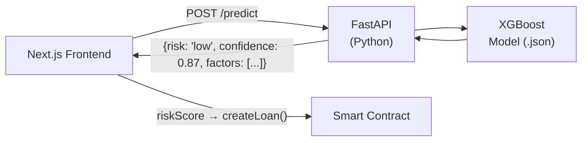

# AI-Based Risk Assessment — Implementation Plan

## Goal

Replace the current rule-based scoring (`risk-scoring.ts`, 5-category weighted formula) with a trained ML model that classifies loan requests into **Low Risk**, **Moderate Risk**, or **High Risk** with a confidence score.

---

## 1. Data Strategy

### Training Data Sources

Since this is a DeFi platform on testnet, we don't have real loan history. Two approaches:

| Source | What It Provides |
|--------|-----------------|
| **Synthetic dataset** (initial) | Generate 10K+ labeled records by extending `generateMockRiskData()` with known risk distributions |
| **Public datasets** (stronger) | [LendingClub](https://www.kaggle.com/datasets/wordsforthewise/lending-club), [Home Credit Default Risk](https://www.kaggle.com/c/home-credit-default-risk) — real loan outcomes |
| **On-chain data** (future) | After go-live, collect actual repayment/default patterns from the contract events |

### Feature Set (Input to Model)

Map from the existing `RiskInputData` interface:

| Category | Features |
|----------|----------|
| **On-chain** | `walletAgeDays`, `txCount`, `txFrequencyPerMonth`, `portfolioValue`, `defiProtocolsUsed`, `tokenCount` |
| **Identity** | `kycVerified`, `socialAccountsLinked`, `daoMemberships` |
| **Financial** | `monthlyIncome`, `incomeRange`, `existingDebt`, `debtAmount`, `collateralPercentage` |
| **Loan Request** | `amount` (ETH), `interestRateBps`, `termMonths`, `purpose` |
| **History** | `previousLoansCount`, `previousLoansRepaid`, `previousDefaultCount`, `platformTenureDays` |

### Label Definition

| Label | Current Score Range | Meaning |
|-------|-------------------|---------|
| **Low Risk** | 700–1000 | High likelihood of full repayment |
| **Moderate Risk** | 400–699 | Some risk, may need higher interest or collateral |
| **High Risk** | 0–399 | High default probability |

---

## 2. Model Selection

### Recommended: Gradient Boosted Trees (XGBoost / LightGBM)

**Why not a neural network?**
- Tabular data with <30 features → tree-based models consistently outperform deep learning
- Interpretable (feature importance, SHAP values) — critical for lending decisions
- Fast inference, small model size, easy to deploy

| Model | Pros | Cons |
|-------|------|------|
| **XGBoost** ✅ | Best-in-class for tabular, interpretable, fast | Needs feature engineering |
| **LightGBM** | Faster training, handles categoricals natively | Slightly less tuned community |
| **Random Forest** | Simple baseline, no hyperparameter sensitivity | Less accurate than boosted models |
| **Logistic Regression** | Fully interpretable, fast | Too simple for non-linear patterns |
| **Neural Network** | Captures complex patterns | Overkill for tabular, black box, needs more data |

### Training Pipeline

```
Raw Data → Feature Engineering → Train/Val/Test Split (70/15/15)
    → XGBoost Multiclass Classifier (3 classes)
    → Hyperparameter Tuning (Optuna)
    → Export model (ONNX or JSON)
```

---

## 3. Model Training — Step by Step

### Phase 1: Data Preparation (Python)

```
1. Load LendingClub dataset + synthetic data
2. Feature engineering:
   - debt_to_income_ratio = debtAmount / monthlyIncome
   - loan_to_portfolio_ratio = loanAmount / portfolioValue
   - repayment_rate = previousLoansRepaid / previousLoansCount
   - wallet_maturity = walletAgeDays / 365
3. Encode categoricals (purpose → one-hot, incomeRange → ordinal)
4. Normalize continuous features (StandardScaler)
5. Label encoding: Low=0, Moderate=1, High=2
6. Split: 70% train, 15% validation, 15% test
```

### Phase 2: Training

```
1. Train XGBoost multiclass classifier
   - objective: multi:softprob
   - num_classes: 3
   - eval_metric: mlogloss
   - early_stopping_rounds: 50
2. Hyperparameter search (Optuna, 100 trials):
   - max_depth: [3, 10]
   - learning_rate: [0.01, 0.3]
   - n_estimators: [100, 1000]
   - min_child_weight: [1, 10]
   - subsample: [0.6, 1.0]
3. Evaluate on test set:
   - Target: >85% accuracy, >0.80 F1 per class
   - Confusion matrix, precision/recall per risk tier
```

### Phase 3: Explainability

```
1. SHAP values for global feature importance
2. Per-prediction explanations (why was this loan classified as High Risk?)
3. Store top-3 contributing factors per prediction for UI display
```

---

## 4. Deployment Architecture

### Option A: Python API Microservice (Recommended)



- **FastAPI** server hosts the trained model
- Single endpoint: `POST /api/risk-assess` accepts feature vector, returns risk class + confidence + SHAP explanations
- Deploy on: Vercel Serverless (with Python runtime), Railway, or Render

### Option B: ONNX in Browser (Lightweight Alternative)

```
1. Export XGBoost → ONNX format
2. Load ONNX model in browser via onnxruntime-web
3. Inference runs client-side, no backend needed
4. Model file: ~500KB–2MB
```

Tradeoff: no server cost, but model is exposed to the client.

---

## 5. Integration Points (Frontend)

| Where | Current State | After AI Integration |
|-------|--------------|---------------------|
| `borrower/apply` | Hardcoded `mockRiskScore = 720` | Call AI model before `createLoan()`, display risk tier |
| `borrower/risk-score` | Rule-based breakdown UI | Show AI prediction + SHAP-based feature explanations |
| `lender/marketplace` | Shows static risk score | Show AI risk tier badge (Low/Moderate/High) with color |
| `admin/loans` | No risk insight | Show AI risk tier + confidence to help approve/reject |
| `risk-scoring.ts` | 385-line rule-based algorithm | Replace `calculateRiskScore()` with API call or ONNX inference |

---

## 6. Timeline Estimate

| Phase | Duration | Deliverable |
|-------|----------|-------------|
| Data collection + preparation | 2–3 days | Clean, labeled dataset (10K+ records) |
| Model training + tuning | 2–3 days | Trained XGBoost model with >85% accuracy |
| Explainability (SHAP) | 1 day | Feature importance + per-prediction explanations |
| API deployment (FastAPI) | 1–2 days | `/api/risk-assess` endpoint live |
| Frontend integration | 2–3 days | All 4 pages consuming real AI predictions |
| Testing + iteration | 1–2 days | End-to-end validation |
| **Total** | **~10–14 days** | |

---

## 7. Future Enhancements

- **Online learning**: Retrain model periodically with real on-chain repayment/default data from contract events (`LoanRepayment`, `LoanFullyRepaid`)
- **Wallet reputation scoring**: Use on-chain data APIs (Etherscan, Dune) to build real wallet reputation features
- **Multi-model ensemble**: Combine XGBoost with a simple neural net for improved accuracy
- **On-chain model hash**: Store model version hash on-chain for auditability
