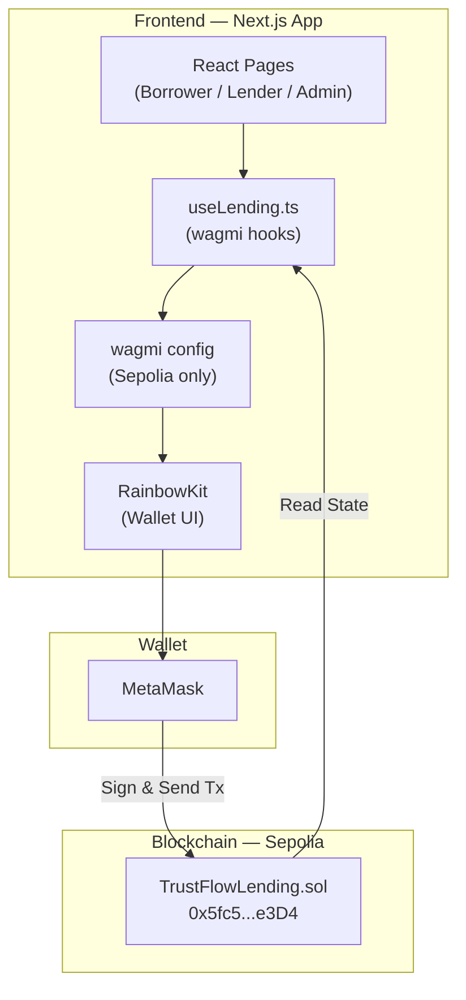
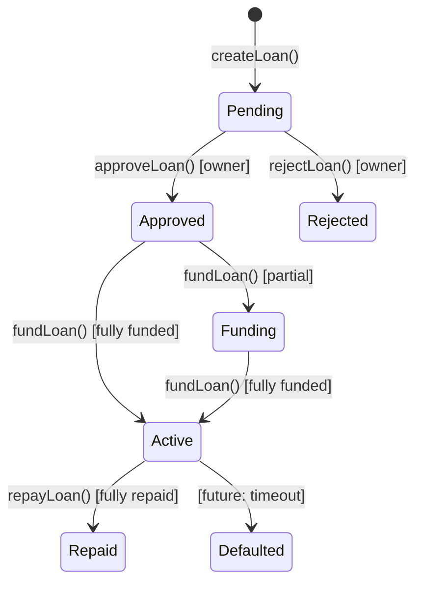
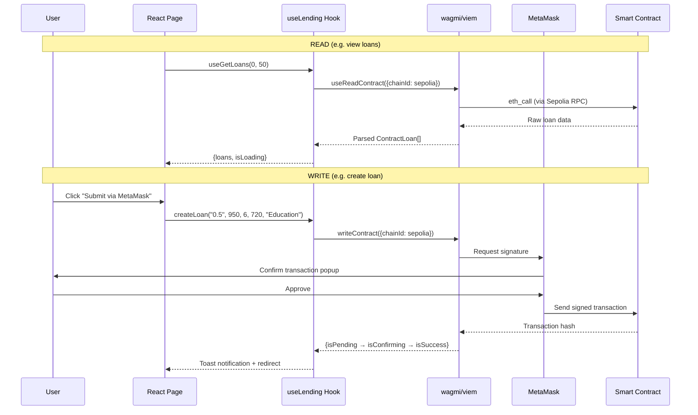
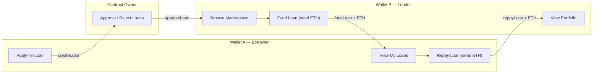

# DeFi TrustFlow — System Architecture

## Overview

DeFi TrustFlow is a decentralized micro-lending platform built on the Ethereum Sepolia testnet. Borrowers apply for ETH loans, an admin (contract owner) approves them, lenders fund loans with real ETH via MetaMask, and borrowers repay over time — all managed by an on-chain smart contract.

## Tech Stack

| Layer | Technology |
|-------|-----------|
| **Smart Contract** | Solidity 0.8.24, Hardhat |
| **Frontend** | Next.js 14 (App Router), React, TypeScript |
| **Blockchain Integration** | wagmi v2, viem, RainbowKit |
| **Styling** | Tailwind CSS, shadcn/ui |
| **Network** | Ethereum Sepolia Testnet (Chain ID: 11155111) |
| **Wallet** | MetaMask (via RainbowKit connector) |

## Architecture Diagram



## Smart Contract — `TrustFlowLending.sol`

**Address:** `0x5fc5725D3adFbC281bCD387117982eA38581e3D4`

### Loan Lifecycle (State Machine)



### Key Functions

| Function | Caller | Action |
|----------|--------|--------|
| `createLoan(amount, rate, term, riskScore, purpose)` | Borrower | Creates loan request (status → Pending) |
| `approveLoan(loanId)` | Owner | Approves loan for funding |
| `rejectLoan(loanId)` | Owner | Rejects loan |
| `fundLoan(loanId)` + ETH value | Lender | Funds loan with ETH, transfers to borrower minus platform fee |
| `repayLoan(loanId)` + ETH value | Borrower | Repays loan with ETH |

### Fee Model
- **Platform fee:** 2% (200 bps) deducted from funded amount
- Fee held in contract, withdrawable by owner via `withdrawFees()`

## Frontend Architecture

### Directory Structure

```
src/
├── app/                        # Next.js App Router pages
│   ├── borrower/               # Borrower dashboard, apply, loans, repay, risk-score
│   ├── lender/                 # Lender dashboard, marketplace, portfolio, auto-invest
│   ├── admin/                  # Admin dashboard, loan management, users, settings
│   └── auth/                   # Login & register (MetaMask connect)
├── components/
│   ├── layout/DashboardLayout  # Shared layout with sidebar, wallet address display
│   └── ui/                     # shadcn/ui components
├── hooks/
│   └── useLending.ts           # All wagmi hooks for contract interaction
└── lib/
    ├── contracts.ts            # ABI, contract address, status mapping
    ├── wagmi.ts                # wagmi + RainbowKit config (Sepolia only)
    ├── utils.ts                # formatEth, shortenAddress, risk helpers
    └── constants.ts            # Navigation items, config
```

### Data Flow



### Hook Layer (`useLending.ts`)

All hooks enforce `chainId: sepolia.id` to prevent wrong-network transactions.

| Hook | Type | Purpose |
|------|------|---------|
| `useGetLoans(offset, limit)` | Read | Fetch paginated loans |
| `useLoanCount()` | Read | Total loan count |
| `useBorrowerLoanIds(address)` | Read | Loan IDs for a borrower |
| `useLenderInvestmentIds(address)` | Read | Investment IDs for a lender |
| `useContractOwner()` | Read | Contract owner address |
| `useCreateLoan()` | Write | Submit loan application |
| `useFundLoan()` | Write | Fund loan with ETH |
| `useRepayLoan()` | Write | Repay loan with ETH |
| `useApproveLoan()` | Write | Admin approve (owner only) |
| `useRejectLoan()` | Write | Admin reject (owner only) |

## User Roles & Wallet Flow



- **Sidebar** displays the connected wallet address (`0xAbCd...Ef12`) via `useAccount()`
- Users switch roles by navigating to `/borrower`, `/lender`, or `/admin` routes
- Admin actions are gated on-chain: only the contract owner can approve/reject

## Deployment

| Item | Value |
|------|-------|
| Contract Address | `0x5fc5725D3adFbC281bCD387117982eA38581e3D4` |
| Network | Sepolia (Chain ID 11155111) |
| Deployer | `0x9b26e5188c9Bf7244Ca1BfeaB6e4D319e730cEEF` |
| Etherscan | [View Contract](https://sepolia.etherscan.io/address/0x5fc5725D3adFbC281bCD387117982eA38581e3D4) |
| Compiler | Solidity 0.8.24 with optimizer (200 runs) |
| Tests | 18/18 passing (Hardhat + Chai) |
